## MOSFET Operational Regions

The working of a MOSFET (Metal-Oxide-Semiconductor Field-Effect Transistor) is divided into three main operational regions:

### 1. Cut-off Region
The Gate voltage is less than the Threshold Voltage ($V_{TH}$), so no conductive channel is formed between the Source and Drain terminals. The MOSFET acts like an open switch in this region.

### 2. Linear or Ohmic Region
The Gate voltage is greater than the Threshold Voltage, and $V_{DS} < V_{GS} - V_{TH}$. A channel is formed, and the Drain Current ($I_D$) increases almost linearly with the Drain-Source Voltage ($V_{DS}$). For very small $V_{DS}$ (i.e., $V_{DS} \ll V_{GS} - V_{TH}$), the term $\frac{1}{2} V_{DS}^2$ is negligible, making $I_D$ directly proportional to $V_{DS}$.

### 3. Saturation Region
$V_{DS} \ge V_{GS} - V_{TH}$ and $V_{GS} > V_{TH}$ in this region. The channel becomes "pinched off" near the drain end. The voltage drop across the conducting part of the channel remains fixed at $V_{GS} - V_{TH}$. Any further increase in $V_{DS}$ is dropped across the pinched-off region, and the current essentially saturates (becomes constant) for a fixed $V_{GS}$.

## Body Effect

### Reverse Bias
A reverse bias between the source and the body increases the width of the depletion region beneath the channel. To form the conductive channel, the gate must now overcome the charge of this wider depletion region. This requires a larger gate-to-source voltage ($V_{GS}$), which means the threshold voltage ($V_{th}$) increases in magnitude.

### Forward Bias
A forward bias ($V_{SB}$ forward biases the source-body junction): A small forward bias tends to decrease the magnitude of the threshold voltage, making the transistor easier to turn on.
# NMOS and MOSFET Analysis

## NMOS Structural Components

NMOS has four main structural components:

### 1. Substrate (or Body, B)
- **Material:** Usually a p-type silicon material, which contains an abundance of "holes" as its majority charge carriers.

### 2. Source (S) and Drain (D)
- **Material:** Two regions heavily doped with n-type impurities ($\text{n}^+$), which means they have an excess of free electrons (the majority carriers).

### 3. Gate (G)
- **Material:** A conductive layer, typically polysilicon or metal.
- **Function:** The control terminal. A voltage applied here creates an electric field that regulates the formation of a conductive path (the channel) between the source and drain.

### 4. Oxide Layer (Gate Oxide)
- **Material:** A very thin layer of insulating material, usually silicon dioxide ($\text{SiO}_2$), located directly between the gate terminal and the underlying substrate.

## Operating Principle

When a positive voltage ($V_{GS}$) is applied to the Gate, the electric field penetrates the oxide and attracts the minority carriers (electrons) from the p-type substrate toward the surface.

If the voltage is high enough (above the threshold voltage, $V_{TH}$), a layer of electrons forms beneath the gate oxide, inverting the p-type surface to an n-type region. This forms a conductive path, called the n-channel, that connects the $\text{n}^+$ source and drain regions.

Once the channel is formed, current (electron flow) can pass from the Source to the Drain.

## SPICE Simulation

### Commands

git clone https://github.com/kunalg123/sky130CircuitDesignWorkshop/

ngspice day1_nfet_idvds_L2_W5.spice

plot - vdd#branch (or) plot out vs in

### SPICE Netlist for NMOS

*Model Description

.param temp=27

*Including sky130 library files
.lib "sky130_fd_pr/models/sky130.lib.spice" tt

*Netlist Description

XM1 Vdd n1 0 0 sky130_fd_pr__nfet_01v8 w=5 l=2

R1 n1 in 55

Vdd vdd 0 1.8V

Vin in 0 1.8V

*simulation commands

.op

.dc Vdd 0 1.8 0.1 Vin 0 1.8 0.2

.control

run

display

setplot dc1

.endc

.end

#### Netlist Component Descriptions
- **XM1:** Defines an NMOS transistor named XM1. Nodes (Drain, Gate, Source, Bulk): Connected to Vdd (Drain), n1 (Gate), 0 (Source, which is Ground), and 0 (Bulk/Body, which is also Ground).
- **R1:** Defines a resistor named R1 connected between nodes n1 and in with a value of $55 \text{ Ohms}$.
- **Vdd:** Defines a DC voltage source named Vdd connected between node vdd and ground (0) with a value of $1.8 \text{ Volts}$.
- **Vin:** Defines a DC voltage source named Vin connected between node in and ground (0) with a value of $1.8 \text{ Volts}$.
- **DC Sweep:** Performs a DC Sweep analysis where Source Vdd is swept from $0\text{V}$ to $1.8\text{V}$ in steps of $0.1\text{V}$, Source Vin is swept from $0\text{V}$ to $1.8\text{V}$ in steps of $0.2\text{V}$.
- 
  ## Analysis Results

### Characteristic Curves
- Id vs VDS curves for different values of VGS

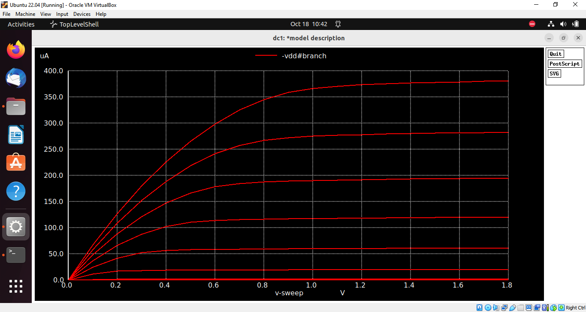
- Id vs VDS curves for different values of VGS for NMOS with w=0.39 l=0.15

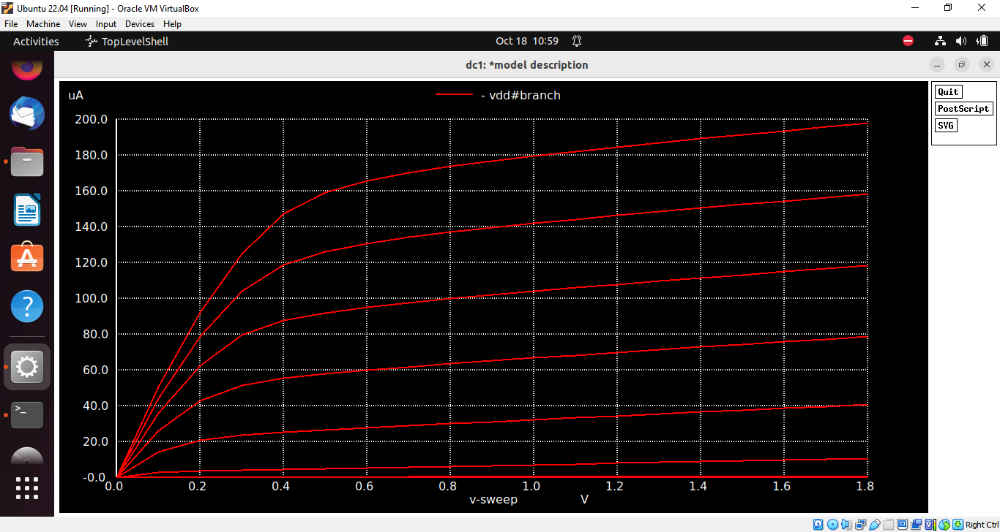
- Id vs VGS curves

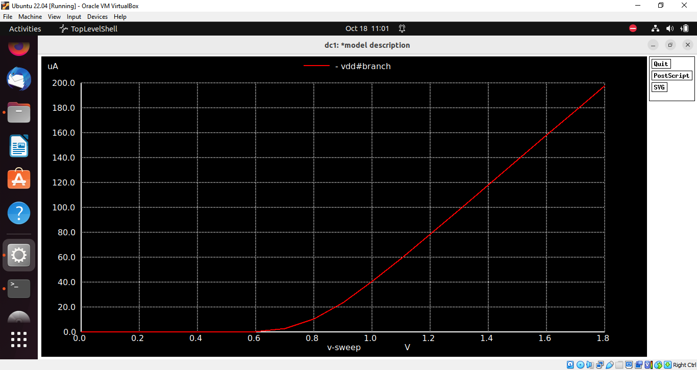
- Vout vs Vin for CMOS inverter

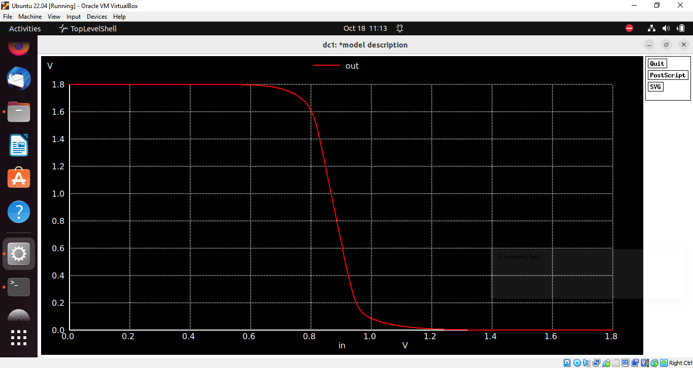
- Transient Analysis waveform

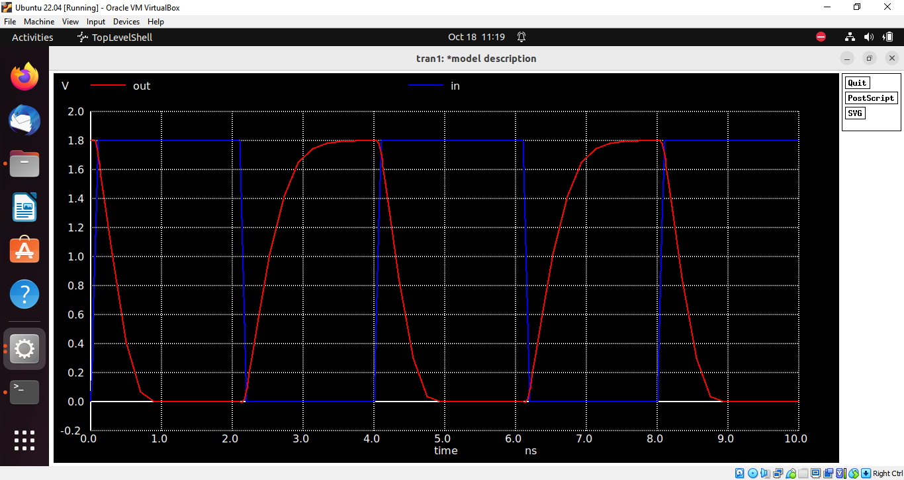
### Timing Analysis

#### Rise Time Calculation

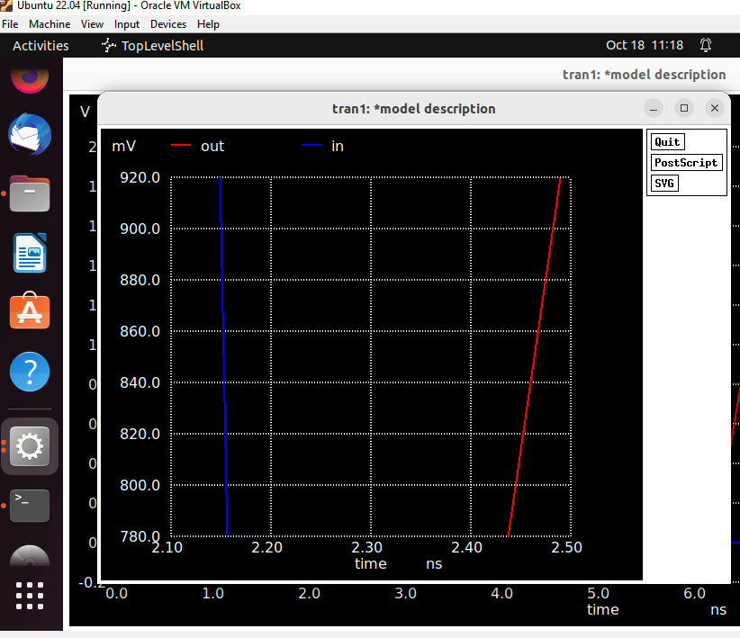

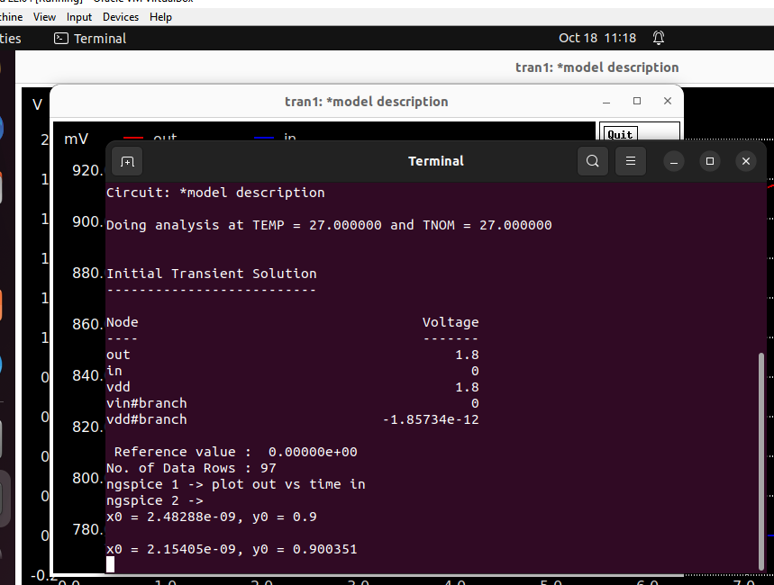

Rise time = $(2.4828-2.1540) \times 10^{-9} = 0.3288 \text{ ns}$

#### Fall Time Calculation

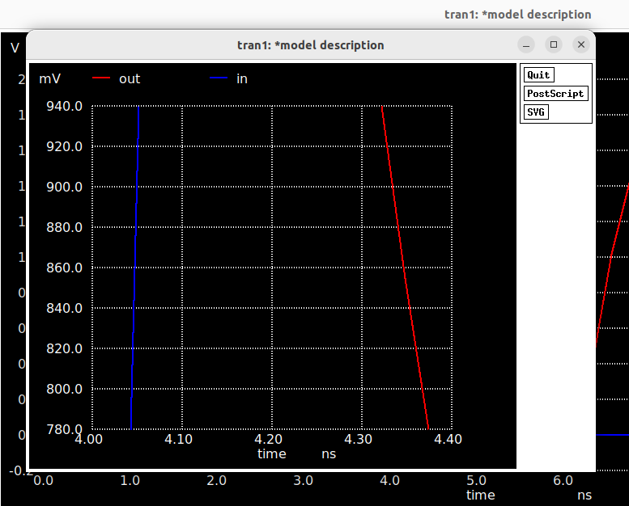

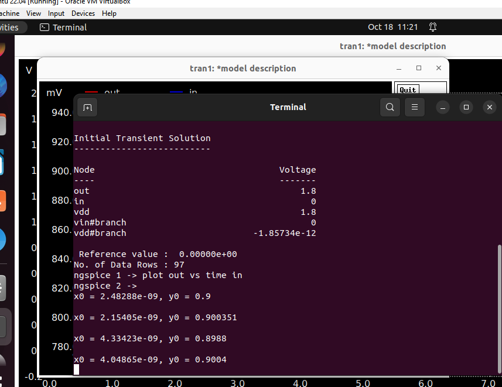

Fall time = $(4.3342-4.0486) \times 10^{-9} = 0.2856 \text{ ns}$

### Noise Margin Calculation

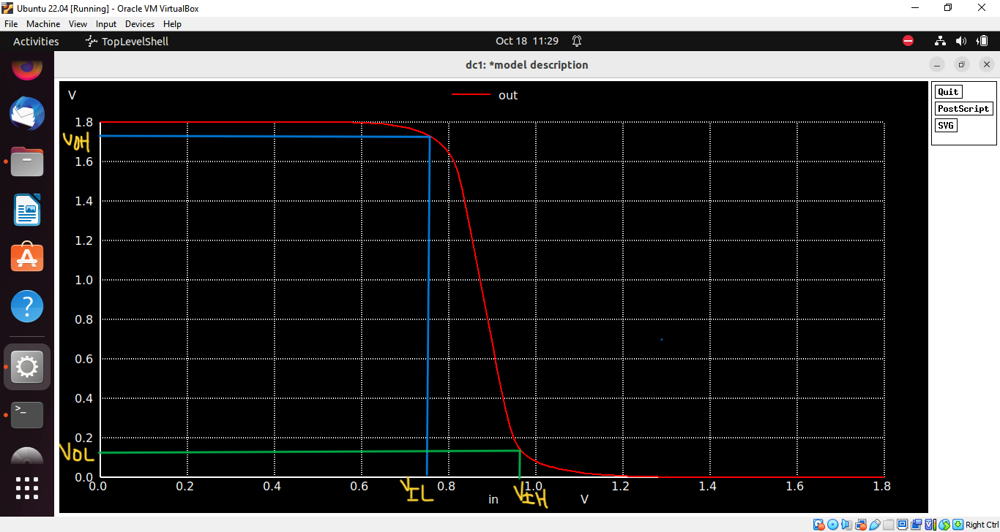

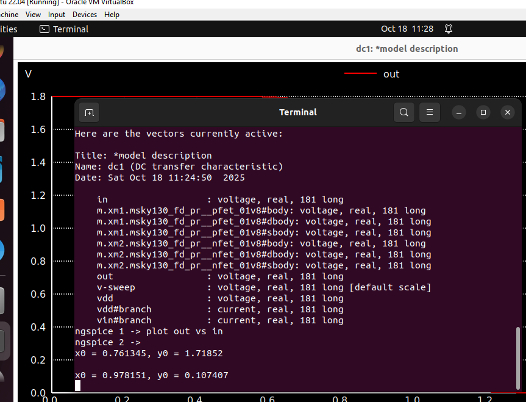

- (NM)_h = V(oh) - V(ih) = 1.7185 - 0.9781 = 0.7404 V
- (NM)_l = V(il) - V(ol) = 0.7613 - 0.1074 = 0.6539 V
### Supply Variation

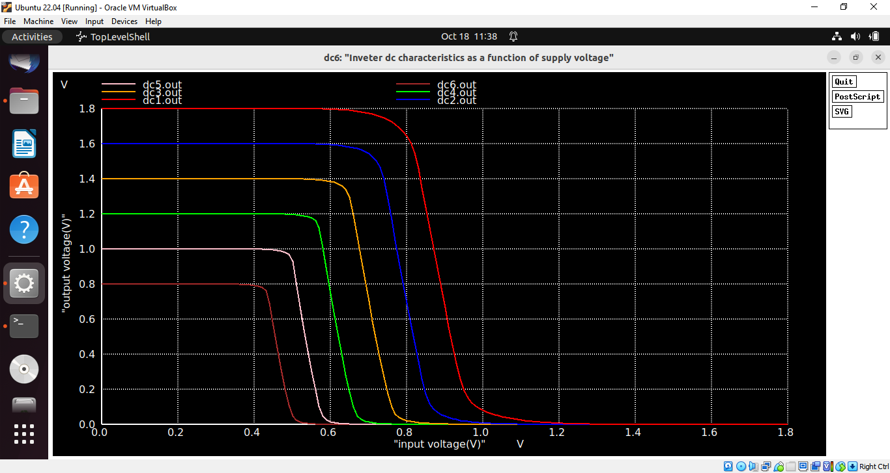
## Gain vs Supply Voltage Table

| Curve Name | Corresponding VDD (V) | Calculated Gain (Av) |
|-------------|-----------------------|----------------------|
| dc1.out (Red) | 1.8 | -7.84 |
| dc2.out (Blue) | 1.6 | -8.67 |
| dc3.out (Green) | 1.4 | -9.39 |
| dc4.out (Yellow) | 1.2 | -9.45 |
| dc5.out (Pink) | 1.0 | -9.80 |
| dc6.out (Maroon) | 0.8 | -9.37 |

The gain increased initially as $V_{DD}$ was reduced (from $1.8\text{V}$ to $1.0\text{V}$) due to improved saturation characteristics, and then dropped sharply (at $0.8\text{V}$) because the voltage was no longer high enough to keep the transistors fully functional.

### Device Variation

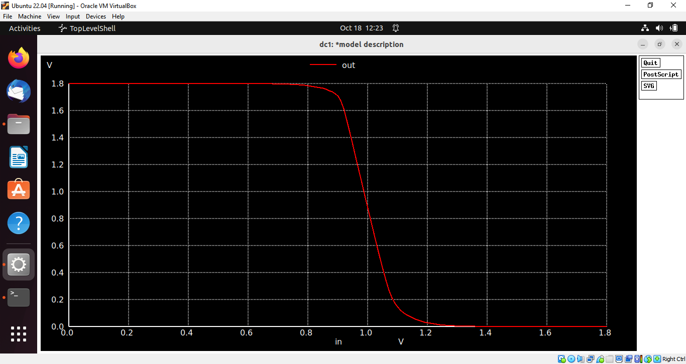

Wide PMOS and smallest NMOS is used. The vout vs vin characteristic is observed to be shifted to right. The output switches from low to high very quickly due to the strong PMOS.The output switches from high to low relatively slowly due to the weak NMOS. The swithcing threshold is alomst 0.9 V.
