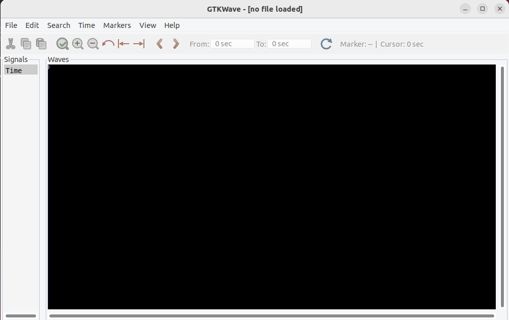

## Tools Installation

# Yosys

$ sudo apt-get update

$ git clone https://github.com/YosysHQ/yosys.git

$ cd yosys

$ sudo apt install make 

$ sudo apt-get install build-essential clang bison flex \
 libreadline-dev gawk tcl-dev libffi-dev git \
 graphviz xdot pkg-config python3 libboost-system-dev \
 libboost-python-dev libboost-filesystem-dev zlib1g-dev
 
$ make config-gcc

$ make

$ sudo make install 

# iverilog

sudo apt-get update

sudo apt-get install iverilog

# gtkwave

sudo apt-get update

sudo apt install gtkwave

