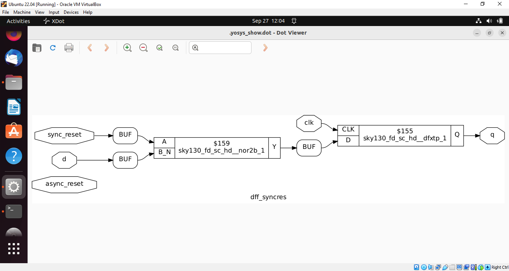

# Asynchronous Reset D Flip-Flop

## Verilog Code

module dff_asyncres (input clk, input async_reset, input d, output reg q);

  always @ (posedge clk, posedge async_reset)
  
    if (async_reset)
    
      q <= 1'b0;
      
    else
    
      q <= d;
      
endmodule

# Asynchronous Set D Flip-Flop

## Verilog Code

module dff_async_set (input clk, input async_set, input d, output reg q);

  always @ (posedge clk, posedge async_set)
  
    if (async_set)
    
      q <= 1'b1;
      
    else
    
      q <= d;
      
endmodule

# Synchronous Reset D Flip-Flop

## Verilog Code

module dff_syncres (input clk, input async_reset, input sync_reset, input d, output reg q);

  always @ (posedge clk)
  
    if (sync_reset)
    
      q <= 1'b0;
      
    else
    
      q <= d;
      
endmodule

## Single submodule

## Hierarchical Synthesis

## Flattened Synthesis

