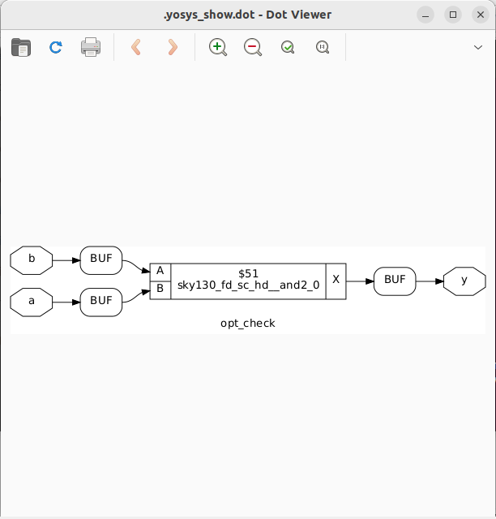
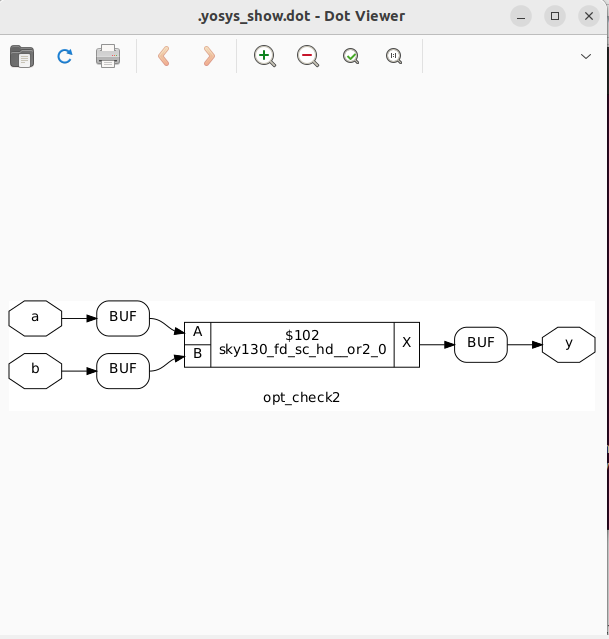
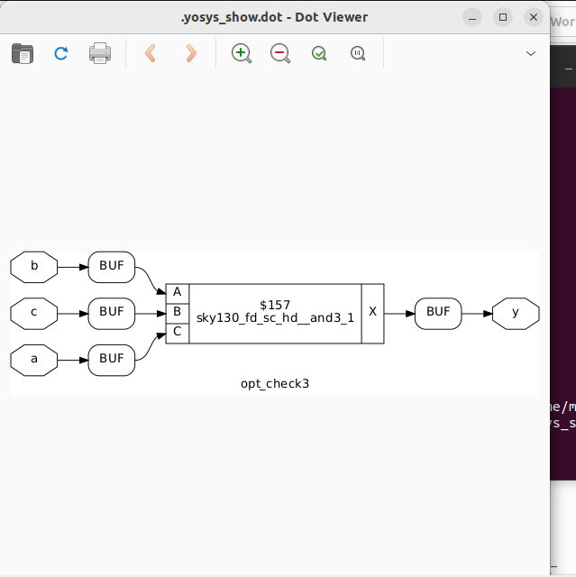
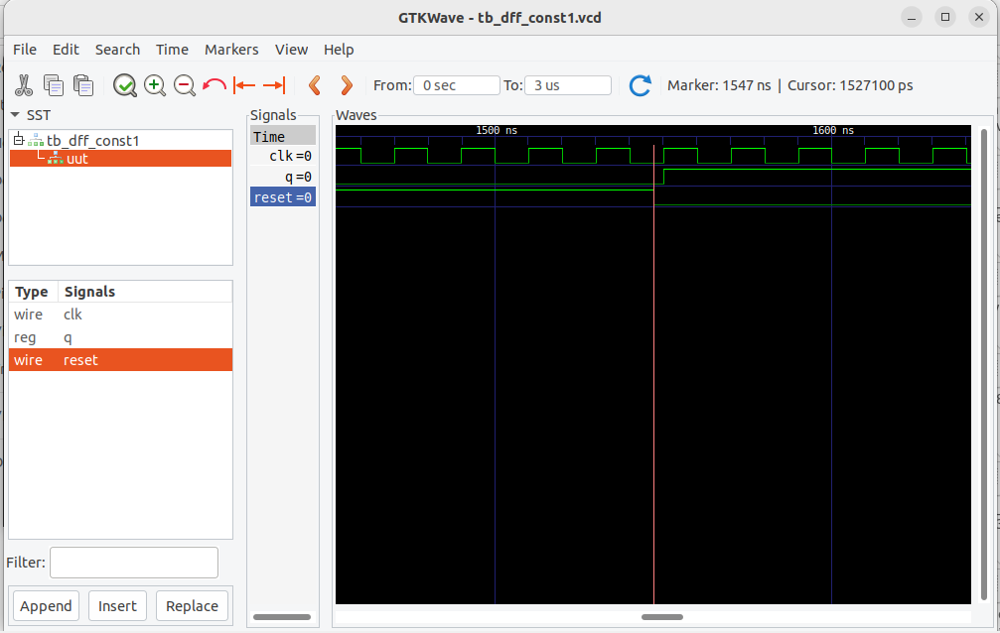
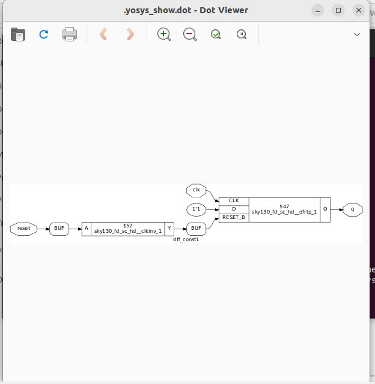
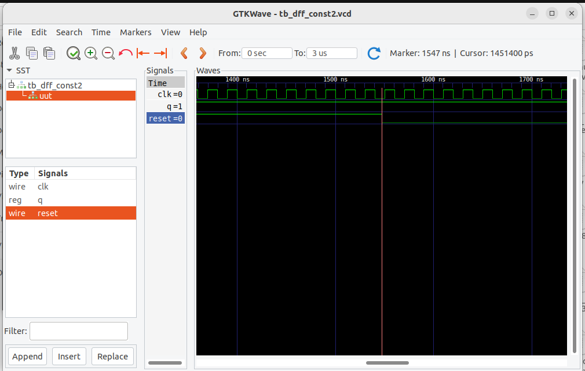
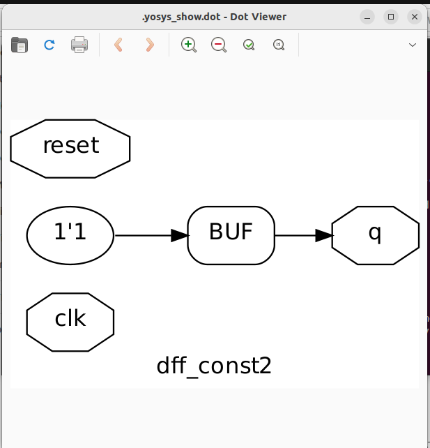
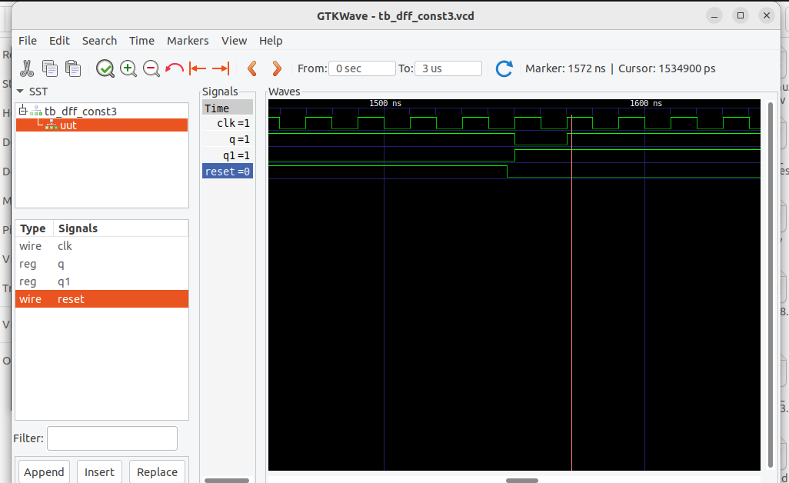
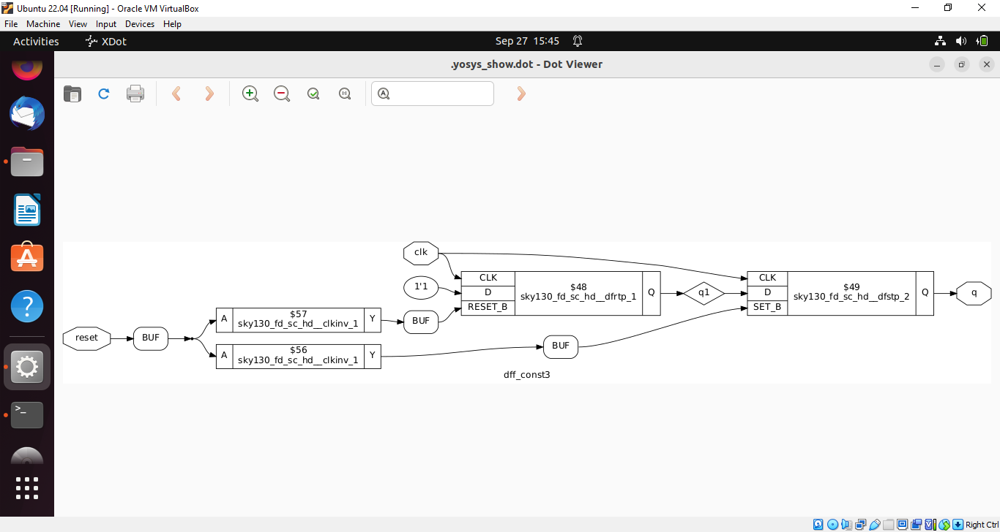

# Optimisation

## 1) Verilog Code

module opt_check (input a , input b , output y);

	assign y = a?b:0;
  
endmodule

opt_clean -purge:Use it during synthesis to remove unused or redundant objects from the design

## 2) Verilog Code

module opt_check2 (input a , input b , output y);

	assign y = a?1:b;
  
endmodule

## 3) Verilog Code

module opt_check2 (input a , input b , output y);

	assign y = a?1:b;
  
endmodule

## 4) Verilog Code

module dff_const1(input clk, input reset, output reg q);

always @(posedge clk, posedge reset)

begin

	if(reset)
  
		q <= 1'b0;
    
	else
  
		q <= 1'b1;
end

endmodule

## 5) Verilog Code

module dff_const2(input clk, input reset, output reg q);

always @(posedge clk, posedge reset)

begin

	if(reset)
  
		q <= 1'b1;
    
	else
  
		q <= 1'b1;
    
end

endmodule

## 6) Verilog Code

module dff_const3(input clk, input reset, output reg q);

reg q1;

always @(posedge clk, posedge reset)

begin

	if(reset)

	begin

		q <= 1'b1;

		q1 <= 1'b0;

	end

	else

	begin

		q1 <= 1'b1;

		q <= q1;

	end

end

endmodule

