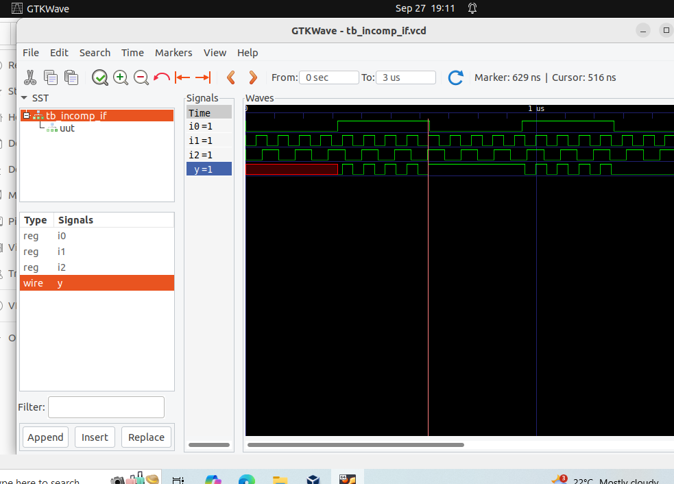
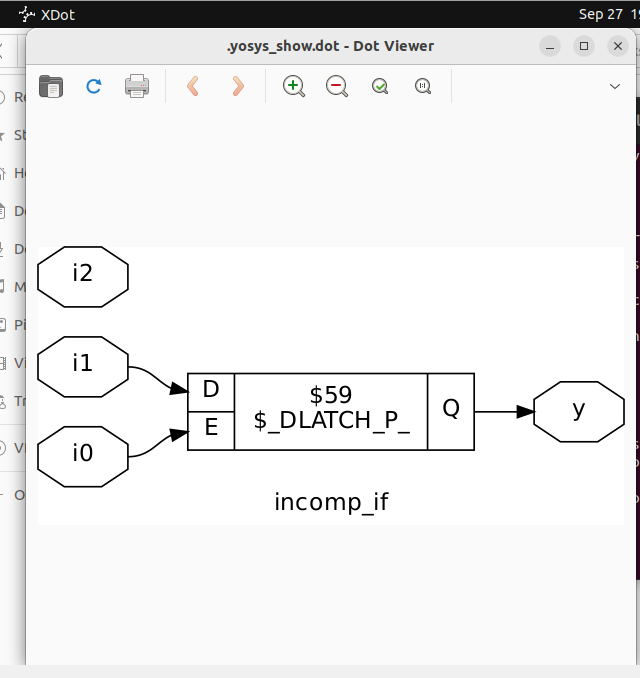
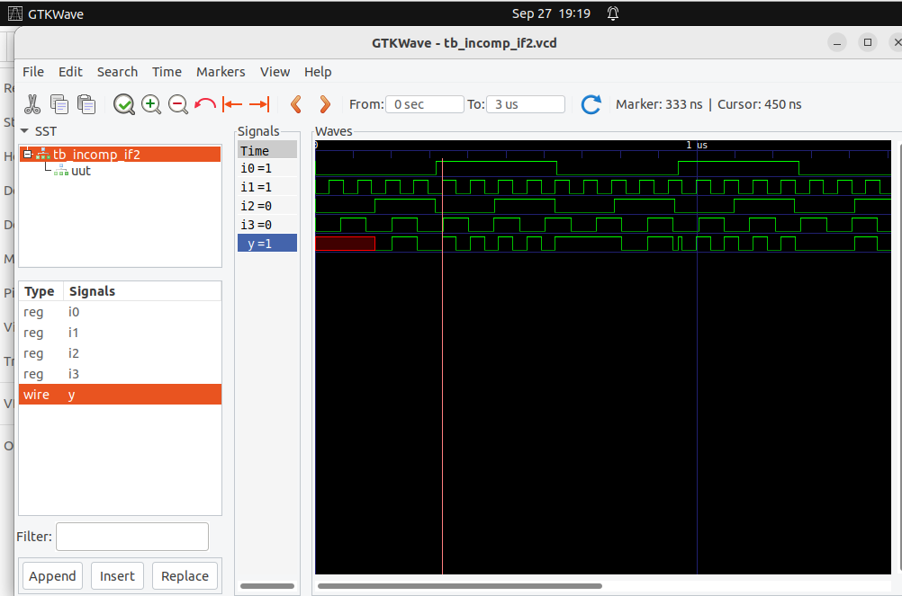
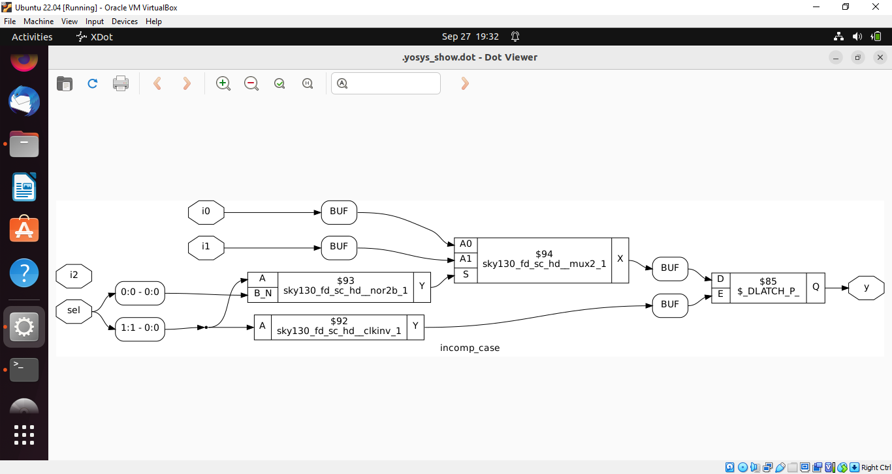
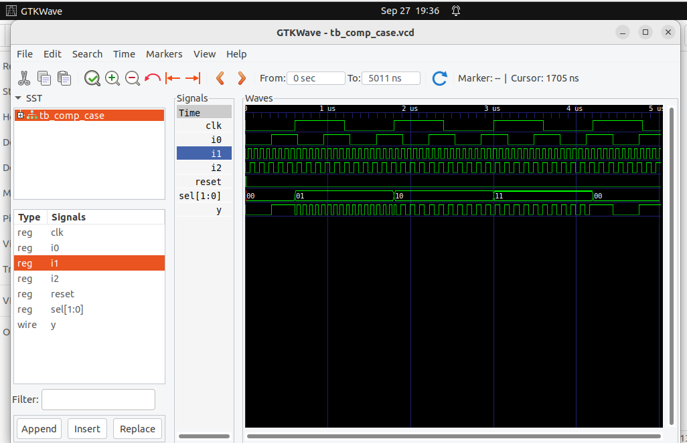
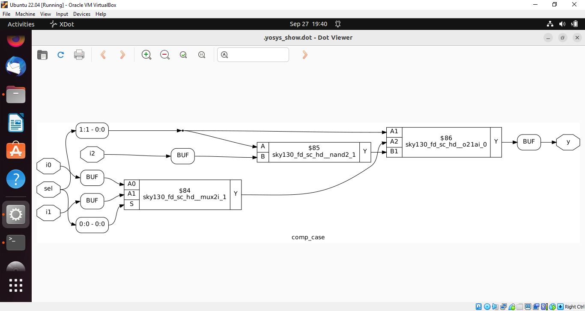
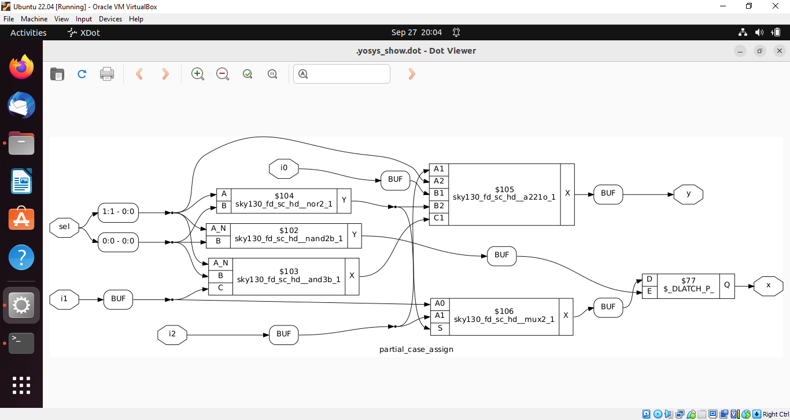
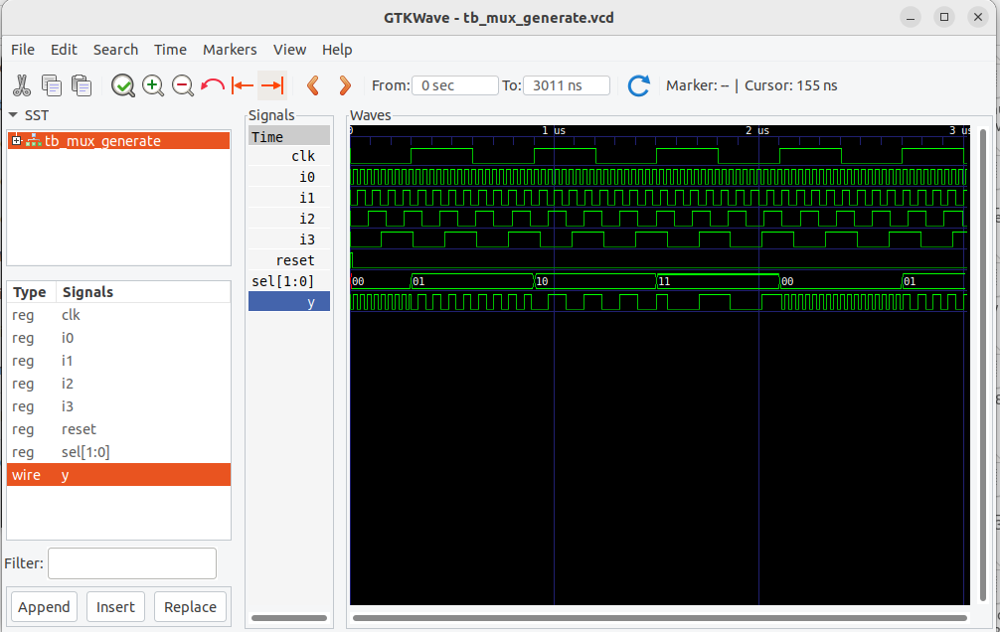
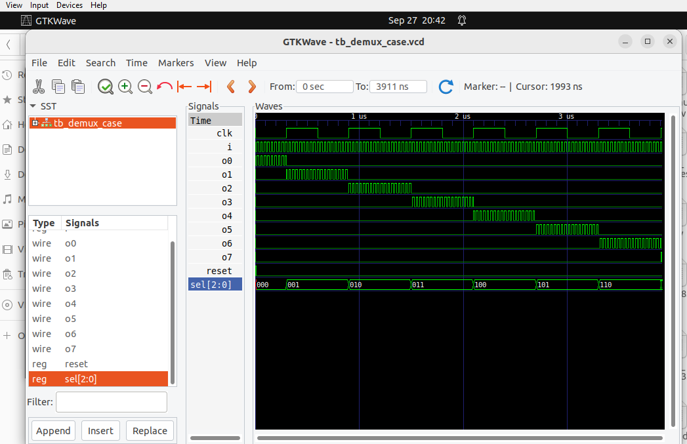
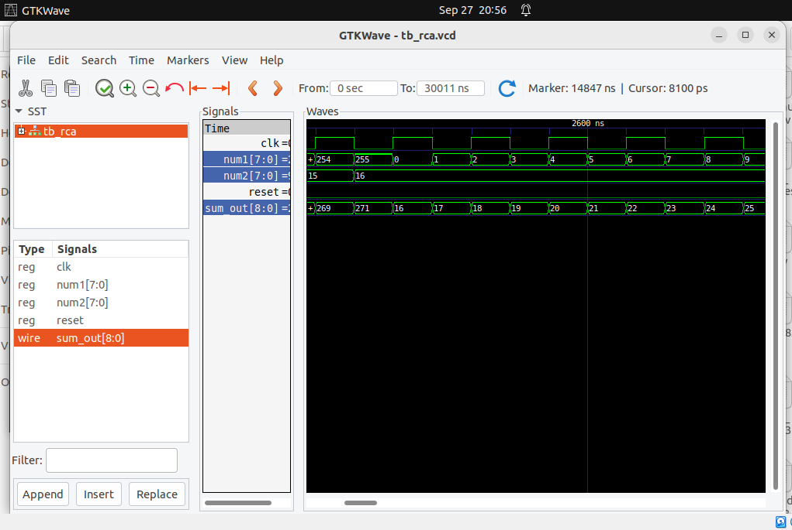

#  If-Else and Case Statements

## Incomplete If Statement

module incomp_if (input i0, input i1, input i2, output reg y);

always @(*) begin

    if (i0)
    
        y <= i1;
        
end

endmodule

# Nested If-Else

module incomp_if2 (input i0, input i1, input i2, input i3, output reg y);

always @(*) begin

    if (i0)
    
        y <= i1;
        
    else if (i2)
    
        y <= i3;
        
end

endmodule

# Complete Case Statement
module comp_case (input i0, input i1, input i2, input [1:0] sel, output reg y);

always @(*) begin

    case(sel)
    
        2'b00 : y = i0;
        
        2'b01 : y = i1;
        
        default : y = i2;
        
    endcase
end

endmodule

# Incomplete Case Handling

module bad_case (
    input i0, input i1, input i2, input i3,
    input [1:0] sel,
    output reg y
);

always @(*) begin

    case(sel)
    
        2'b00: y = i0;
        
        2'b01: y = i1;
        
        2'b10: y = i2;
        
        2'b1?: y = i3; 
    endcase
    
end

endmodule

# Partial Assignments in Case

module partial_case_assign (
    input i0, input i1, input i2,
    input [1:0] sel,
    output reg y, output reg x
);

always @(*) begin

    case(sel)
    
        2'b00: begin
        
            y = i0;
            
            x = i2;
            
        end
        
        2'b01: y = i1;
        
        default: begin
        
            x = i1;
            
            y = i2;
            
        end
        
    endcase
    
end

endmodule

# 4-to-1 MUX Using For Loop

module mux_generate (
    input i0, input i1, input i2, input i3,
    input [1:0] sel,
    output reg y
);

wire [3:0] i_int;

assign i_int = {i3, i2, i1, i0};

integer k;

always @(*) begin

    for (k = 0; k < 4; k = k + 1) begin
    
        if (k == sel)
        
            y = i_int[k]; 
            
    end
    
end

endmodule

# 8-to-1 Demux Using Case

module demux_case (
    output o0, output o1, output o2, output o3,
    output o4, output o5, output o6, output o7,
    input [2:0] sel,
    input i
);

reg [7:0] y_int;

assign {o7, o6, o5, o4, o3, o2, o1, o0} = y_int;

always @(*) begin

    y_int = 8'b0;
    
    case(sel)
    
        3'b000 : y_int[0] = i;
        
        3'b001 : y_int[1] = i;
        
        3'b010 : y_int[2] = i;
        
        3'b011 : y_int[3] = i;
        
        3'b100 : y_int[4] = i;
        
        3'b101 : y_int[5] = i;
        
        3'b110 : y_int[6] = i;
        
        3'b111 : y_int[7] = i;
        
    endcase
    
end

endmodule

# 8-bit Ripple Carry Adder with Generate Block

module rca (
    input [7:0] num1,
    input [7:0] num2,
    output [8:0] sum
);

wire [7:0] int_sum;

wire [7:0] int_co;

genvar i;

generate

    for (i = 1; i < 8; i = i + 1) begin
    
        fa u_fa_1 (.a(num1[i]), .b(num2[i]), .c(int_co[i-1]), .co(int_co[i]), .sum(int_sum[i]));
    end
    
endgenerate

fa u_fa_0 (.a(num1[0]), .b(num2[0]), .c(1'b0), .co(int_co[0]), .sum(int_sum[0]));

assign sum[7:0] = int_sum;

assign sum[8] = int_co[7];

endmodule

Full Adder Module: {Include this also in iverilog command}

module fa (input a, input b, input c, output co, output sum);

    assign {co, sum} = a + b + c;
    
endmodule

